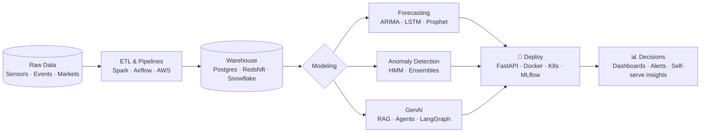

<div align="center">


<br/>

<a href="mailto:kachhwahahardik96@gmail.com"></a>
<a href="https://www.linkedin.com/in/kachhwahahardik96"></a>


</div>

---

## 🧾 Model Card: `hardik-v5.0`

> Most people write an "About Me." I'm a data scientist, so here's my model card.

```yaml
model_name:      hardik-v5.0
model_type:      Data Scientist (production-grade, GenAI-enabled)
current_host:    edYOU Technologies — Data Scientist
location:        California, USA
training_data:
  - 5+ years of real-world ML in EdTech, Energy & Enterprise Software
  - MS, Data Analytics — Northeastern University
  - B.Tech, Computer Science — UPES
fine_tuned_on:
  - LLM systems (RAG, agents, prompt engineering)
  - Time-series forecasting & anomaly detection
  - Cloud data pipelines & MLOps
intended_use:    Turning messy data into systems that make decisions faster
out_of_scope:    Notebooks that never leave the notebook
license:         Open to collaboration 🤝
```

---

## 📈 Training Log

```text
Epoch 1/4  [2018–2020]  L&T Infotech · Software Engineer
           ├─ migrated Vitamix chatbot + voice assistant → AWS Lex/Lambda
           └─ nlp_accuracy: +50%  |  latency: -40%  |  infra_cost: -60%  |  uptime: 99.9%

Epoch 2/4  [2021–2022]  Northeastern University · MS Data Analytics
           └─ loaded weights: ML, Big Data, Data Mining  ✔

Epoch 3/4  [2022–2025]  Biogas Engineering · Data Analyst → Associate Data Scientist
           ├─ HMM predictive maintenance on 250+ devices
           ├─ RAG compliance chatbot (1,000+ queries/month)
           └─ downtime: -30%  |  yield: +25%  |  pricing_accuracy: +30%  |  data_latency: 24h → 1h

Epoch 4/4  [2025–now]   edYOU Technologies · Data Scientist
           ├─ NL-to-SQL analytics platform (GPT/Claude + PostgreSQL memory)
           ├─ learner mastery model on 30K+ records/day
           └─ report_time: -75%  |  query_latency: -50%  |  avatar_cost: -40%  |  adoption: +40%

✅ Training still in progress... no early stopping planned.
```

---

## 🎯 Evaluation Metrics (Production, not Validation)

| Metric | Result | Where |
|---|---|---|
| ⏱️ Report generation time | **↓ 75%** | LLM-powered analytics for educators |
| 🚀 Platform adoption | **↑ 40%** | AI agents for engagement & cohort analysis |
| 🛠️ Unplanned downtime | **↓ 30%** | Hidden Markov Model predictive maintenance |
| 🏭 Production yield | **↑ 25%** | End-to-end ML pipelines |
| 💲 Pricing accuracy | **↑ 30%** | Weather + market revenue forecasting |
| ⚡ Data freshness | **24h → 1h** | Spark ETL over 10GB+/day of sensor data |
| 🗄️ Query latency | **↓ 50%** | DynamoDB → PostgreSQL migration |

---

## 🏗️ How I Build



---

## 🧰 Tech Stack

**Languages**
<p>


</p>

**ML & Deep Learning**
<p>


</p>

**LLM & GenAI**
<p>


</p>

**Cloud, MLOps & Data**
<p>


</p>

**Visualization**
<p>


</p>

---

## 🏭 Production Deployments

> Built for employers, running in production. The code is proprietary; the impact isn't.

| System | What it does | Impact | Stack |
|---|---|---|---|
| 🤖 **Natural-Language Analytics Platform** · *edYOU* | Educators ask questions in plain English and get answers from student data. GPT/Claude are paired with a PostgreSQL memory engine. | **↓75%** report time | GPT · Claude · PostgreSQL |
| 🧠 **Learner Mastery Model** · *edYOU* | Scores student mastery from question accuracy, response-time distributions and strength labels. Feeds real-time educator dashboards. | **30K+** records/day | Python · SQL · Dashboards |
| 🕵️ **Engagement Analysis Agents** · *edYOU* | Multi-tenant AI agents that define KPIs and cohort breakdowns to find where learners drop off. | **↑40%** adoption | LLM Agents · Python |
| 🎭 **Avatar Interaction Modeling** · *edYOU* | Behavioral baseline for avatar sessions across product platforms. Gives product a way to measure feature impact. | **↓40%** avatar cost | Event Modeling · SQL |
| 🗄️ **DynamoDB → PostgreSQL Migration** · *edYOU* | Environment-aware migration with a redesigned, normalized relational schema. | **↓50%** query latency | DynamoDB · PostgreSQL |
| 🔧 **Predictive Maintenance (HMM)** · *Biogas* | Hidden Markov Models on sensor data from 250+ devices flag failures before they happen. | **↓30%** downtime | HMM · Python · AWS |
| 📜 **RAG Compliance Chatbot** · *Biogas* | Engineers query company documentation through retrieval-augmented GPT. | **1,000+** queries/mo | OpenAI · RAG · LangChain |
| 💲 **Revenue Forecasting Engine** · *Biogas* | Combines weather, gas-production metrics and market prices to project customer revenue. | **↑30%** pricing accuracy | Time Series · Python |
| ⚡ **Real-Time Sensor ETL + Alerting** · *Biogas* | Spark pipeline over 10GB+/day of sensor data, with live KPI alerts for leadership. | **24h → 1h** freshness | Spark · S3 · Lambda · Postgres |
| 🗣️ **Conversational AI Migration** · *L&T Infotech* | Moved Vitamix's chatbot and voice assistant to AWS. Serves 10K+ users a month. | **↑50%** NLP accuracy | AWS Lex · Lambda · Dialogflow |

---

## 🔬 Featured Experiments

| Project | What it does | Stack |
|---|---|---|
| 📚 **[RAG Document Q&A](#)** | Semantic search across 1,000+ page documents with 90%+ answer accuracy | LangChain · GPT-4 · Vector DB |
| 📉 **[Equity Factor Model Pipeline](#)** | PCA factor extraction + cross-sectional regression on 10 yrs of NIFTY100 data across daily/weekly/monthly horizons | Python · Supabase · GCP Secret Manager |
| 💼 **[Portfolio & Strategy Dashboard](#)** | Multi-user portfolios, live positions and strategy performance on a 10+ table relational design | PostgreSQL · Python · Viz |
| 🏦 **[Financial Analytics Platform](#)** | Percentile-based peer rankings across sectors & growth metrics on 10+ yrs of data | FastAPI · GKE · PostgreSQL |
| 🚗 **[Carceptron](#)** *(publication)* | Backpropagation neural network predicting car-purchase behavior (+15% accuracy) | Neural Networks |

---

## 🧪 `inference.py`

```python
from hardik import DataScientist

me = DataScientist(experience_years=5, specialties=["Production ML", "GenAI", "Forecasting"])

me.predict("What are you working on?")
# >>> "LLM agents that turn raw learner data into decisions educators can act on."

me.predict("What gets you excited?")
# >>> "Taking a model from Jupyter to a dashboard someone opens every morning."

me.predict("Open to?")
# >>> "Applied AI roles, interesting data problems, and good collaborations."
```

---

## ⚠️ Known Limitations

- Will ask *"what's the baseline?"* before celebrating any metric.
- Strongly believes a model isn't done until it's monitored.
- May refactor your ETL pipeline if left unattended.

---


<div align="center">

🎓 **MIT** — *Machine Learning: From Data to Decision*

<sub>📬 Reach me at <a href="mailto:kachhwahahardik96@gmail.com">kachhwahahardik96@gmail.com</a> · Loss is decreasing, curiosity is not.</sub>

</div>

<!---
hardikk96/hardikk96 is a ✨ special ✨ repository because its `README.md` (this file) appears on your GitHub profile.
You can click the Preview link to take a look at your changes.
--->
